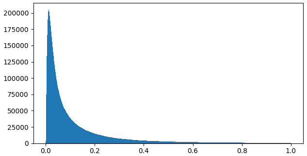
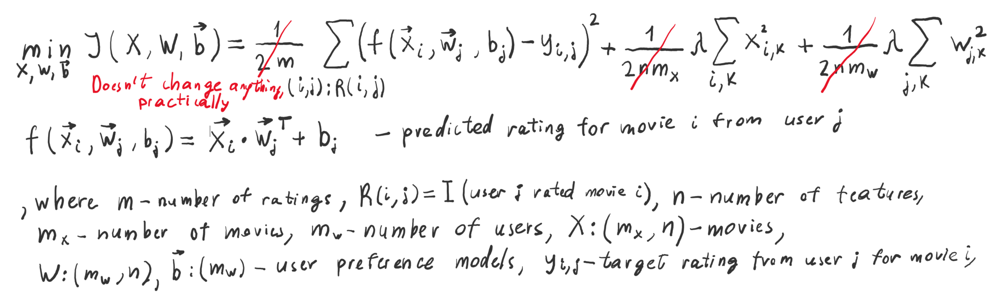
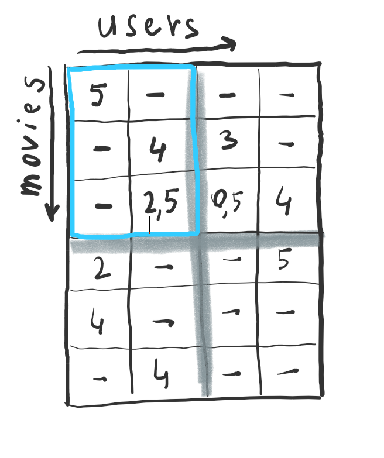

# Dataset

MovieLens dataset consists of the following files:

### movies.csv

**Size:** 58,098 x 3

**Data examples:**

| movieId | title                       | genres                                                          |
|---------|-----------------------------|-----------------------------------------------------------------|
| 1       | Toy Story (1995)            | Adventure&#124;Animation&#124;Children&#124;Comedy&#124;Fantasy |
| 144078  | Kleinhoff Hotel (1977)      | (no genres listed)                                              |
| 146854  | Dov'è la Libertà...? (1954) | Comedy                                                          |

**Genres:**

* Action
* Adventure
* Animation
* Children's
* Comedy
* Crime
* Documentary
* Drama
* Fantasy
* Film-Noir
* Horror
* Musical
* Mystery
* Romance
* Sci-Fi
* Thriller
* War
* Western
* (no genres listed)

### ratings.csv

**Size:** 27,753,444 x 4

**Data examples:**

| userId | movieId | rating | timestamp  |
|--------|---------|--------|------------|
| 4      | 296     | 5.0    | 1113767056 |
| 65835  | 134853  | 0.5    | 1468203075 |

Ratings are made on a 5-star scale with half-star increments (0.5 stars - 5.0 stars).

### tags.csv

**Size:** 1,108,997 x 4

**Data examples:**

| userId | movieId | tag                       | timestamp  |
|--------|---------|---------------------------|------------|
| 14     | 110     | epic                      | 1443148538 |
| 50924  | 46976   | Dustin Hoffman            | 1248086227 |
| 152473 | 2551    | twins/inter-related lives | 1264325551 |
| 193831 | 175     | Chloë Sevigny            | 1388598582 |
| 240383 | 106749  | seen more than once       | 1500708928 |
| 271131 | 64993   | 01/10                     | 1264325551 |

### genome-tags.csv

**Size:** 1,128 x 2

**Data examples:**

| tagId | tag                                         |
|-------|---------------------------------------------|
| 14    | 9/11                                        |
| 339   | easily confused with other movie(s) (title) |
| 418   | funny as hell                               |
| 601   | life & death                                |
| 754   | oscar (best music - original score)         |

The tag genome is a data structure that contains tag relevance scores for movies. The structure is a dense matrix: each
movie in the genome has a value for *every* tag in the genome.

As described in [this article][genome-paper] the tag genome encodes how strongly movies exhibit particular properties
represented by tags (atmospheric thought-provoking realistic etc.). The tag genome was computed using a machine learning
algorithm on user-contributed content including tags ratings and textual reviews.

[genome-paper]: http://files.grouplens.org/papers/tag_genome.pdf

### genome-scores.csv

**Size:** 14,862,528 x 3

**Data examples:**

| movieId | tagId | relevance            |
|---------|-------|----------------------|
| 1       | 1     | 0.029000000000000026 |
| 55159   | 603   | 0.657                |

# Goal

Build a recommender system, whose optimization problem is predicting ratings. Users will be recommended movies with the
highest predicted ratings.

# Workflow

## Dataset inspection

Script:

```shell
dataset_overview.py
```

### movies.csv

Brief info:

```text
Movies count: 58098
Movies with unique ID count: 58098
Movies with unique title count: 58020
Min movie ID: 1
Max movie ID: 193886
Genres (20): {'Thriller', 'Romance', 'Musical', 'Adventure', 'Children', 'War', 'Sci-Fi', 'Animation', 'Action', 'IMAX',
'Mystery', '(no genres listed)', 'Drama', 'Comedy', 'Horror', 'Film-Noir', 'Fantasy', 'Crime', 'Documentary', 'Western'}
```

Notes:

* Extra genre: IMAX. There are several movies with it in the dataset.
* Titles repeat, but it won't affect results because it's very rare.

### ratings.csv

Brief info:

```text
Unique scores: [0.5 1.  1.5 2.  2.5 3.  3.5 4.  4.5 5. ]
Number of unique movies: 53889
```

Notes:

* At least 7.2% of movies don't have ratings

### tags.csv

Brief info:

```text
Number of unique tags (case insensitive): 66981
Number of unique movies: 45981
```

Notes:

* At least 20.8% of movies don't have tags.
* Timestamp is irrelevant.

### genome-tags.csv

Brief info:

```text
Number of tags absent in ratings.csv (case insensitive): 0
```

Notes:

* all genome tags are present in ratings.csv if comparing case-insensitively.

### genome-scores.csv

Brief info:

```text
Unique movie number: 13176
Number of scores with tag ids absent in genome-tags.csv: 0
Min relevance: 0.0002499999999999
Max relevance: 1.0
```

Genome score distribution:



Notes:

* At least 77.3% of movies don't have genome scores.
* All genome scores have string representation
* All genome scores' string representations are present in ratings.csv if comparing case-insensitively.

## Plan

For most movies we have the following info that can help us make recommendations:

* Genre
* Ratings
* Tags

Some tags have genome scores. Also, we can add _average rating_ feature for movies.

For users, we have only:

* Ratings

Additionally, we can add _average genre rating_ feature.

We will try to take advantage of all of this data, but progressively. The general plan is:

1. Build a **collaborative filtering** recommender. This system will learn features based solely on user ratings. These
   features will help us later, hopefully.
2. Build a **content-based filtering** recommender using one-hot encoded genre, average rating and user's average genre
   rating info.
3. Build a **tag embeddings** recommender. We will find pre-trained embeddings on the internet. Then we will represent
   every movie as a normalized weighted sum of its tags' embeddings. To do a recommendation, we will take a weighted sum
   of all movie embeddings, that current user has rated, and find movies that are closest to resulting vector.
4. **Combine the recommenders** listed above into a single content-based recommender.

## Collaborative filtering

For this algorithm we need only one file:

* _dataset/ratings.csv_

Optimization problem:



We need only ratings.csv for this one. Data is basically a sparse matrix with movies as rows, users as columns and
ratings as values. Max user id is 283229 and max movie id is 193887, so it has size of 283,229 x 193,887.

Vanilla collaborative filtering algorithm suggests using the whole dataset for each gradient descent iteration. This is
a problem because the algorithm creates a dense estimate matrix which has the same size, in order to compute the cost.
It would require more than 204 Gb of memory.

To solve this problem, we're going to split the dataset into square mini-batches, as shown below:



Then, we'll basically apply mini-batch gradient descent.

The ratings will be split into training, development and test sets with ratios 50:25:25, respectively. These splits will
be used for training, tuning, and evaluating other recommender system implementations as well.

Another problem of this algorithm is likely to be too computationally expensive. There's not much we could do about it,
so let's implement it and test without detailed analysis, in order to find out whether it's even worth spending our
time.

Results:

```text
Time elapsed for training and evaluating: 101.1 minutes
MSE (train): 1.0948103177789987
MSE (dev): 1.1399717581768327
```

OMG, it took nearly 2 hours to go through 15 epochs of training! We're not going to repeat this process ever again. MSE
is surprisingly good, given that collaborative filtering doesn't consider any data but ratings, dataset is sparse,
hyperparameters were picked at almost at random, feature number was quite random, and our algorithm is custom in
general. Apparently, we could improve evaluation precision by picking different hyperparams, trying different
optimizers, etc., but it would require too much time to retrain the model.

The parameters we've trained are likely to give substantial info about movies and users, so we'll try to **embed them
in the final content-based algorithm**. They are saved in:

* _dataset/collaborative_features/movies.csv_
* _dataset/collaborative_features/users.csv_

# References

* Jesse Vig Shilad Sen and John Riedl. 2012. The Tag Genome: Encoding Community Knowledge to Support Novel Interaction.
  ACM Trans. Interact. Intell. Syst. 2 3: 13:1–13:44. <https://doi.org/10.1145/2362394.2362395>
* F. Maxwell Harper and Joseph A. Konstan. 2015. The MovieLens Datasets: History and Context. ACM Transactions on
  Interactive Intelligent Systems (TiiS) 5, 4: 19:1–19:19. <https://doi.org/10.1145/2827872>
