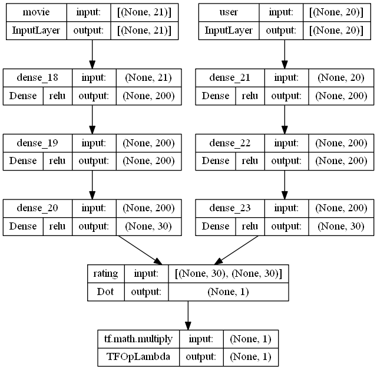
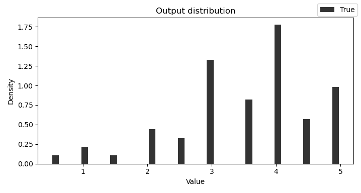
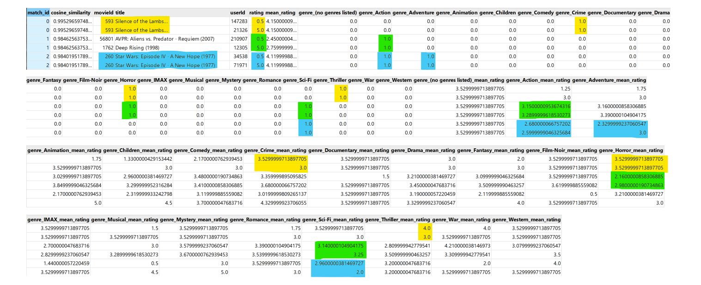

# Dataset

MovieLens dataset consists of the following files:

### movies.csv

**Size:** 58,098 x 3

**Data examples:**

| movieId | title                       | genres                                                          |
|---------|-----------------------------|-----------------------------------------------------------------|
| 1       | Toy Story (1995)            | Adventure&#124;Animation&#124;Children&#124;Comedy&#124;Fantasy |
| 144078  | Kleinhoff Hotel (1977)      | (no genres listed)                                              |
| 146854  | Dov'è la Libertà...? (1954) | Comedy                                                          |

**Genres:**

* Action
* Adventure
* Animation
* Children's
* Comedy
* Crime
* Documentary
* Drama
* Fantasy
* Film-Noir
* Horror
* Musical
* Mystery
* Romance
* Sci-Fi
* Thriller
* War
* Western
* (no genres listed)

### ratings.csv

**Size:** 27,753,444 x 4

**Data examples:**

| userId | movieId | rating | timestamp  |
|--------|---------|--------|------------|
| 4      | 296     | 5.0    | 1113767056 |
| 65835  | 134853  | 0.5    | 1468203075 |

Ratings are made on a 5-star scale with half-star increments (0.5 stars - 5.0 stars).

### tags.csv

**Size:** 1,108,997 x 4

**Data examples:**

| userId | movieId | tag                       | timestamp  |
|--------|---------|---------------------------|------------|
| 14     | 110     | epic                      | 1443148538 |
| 50924  | 46976   | Dustin Hoffman            | 1248086227 |
| 152473 | 2551    | twins/inter-related lives | 1264325551 |
| 193831 | 175     | Chloë Sevigny            | 1388598582 |
| 240383 | 106749  | seen more than once       | 1500708928 |
| 271131 | 64993   | 01/10                     | 1264325551 |

### genome-tags.csv

**Size:** 1,128 x 2

**Data examples:**

| tagId | tag                                         |
|-------|---------------------------------------------|
| 14    | 9/11                                        |
| 339   | easily confused with other movie(s) (title) |
| 418   | funny as hell                               |
| 601   | life & death                                |
| 754   | oscar (best music - original score)         |

The tag genome is a data structure that contains tag relevance scores for movies. The structure is a dense matrix: each
movie in the genome has a value for *every* tag in the genome.

As described in [this article][genome-paper] the tag genome encodes how strongly movies exhibit particular properties
represented by tags (atmospheric thought-provoking realistic etc.). The tag genome was computed using a machine learning
algorithm on user-contributed content including tags ratings and textual reviews.

[genome-paper]: http://files.grouplens.org/papers/tag_genome.pdf

### genome-scores.csv

**Size:** 14,862,528 x 3

**Data examples:**

| movieId | tagId | relevance            |
|---------|-------|----------------------|
| 1       | 1     | 0.029000000000000026 |
| 55159   | 603   | 0.657                |

# Goal

Build a recommender system, whose optimization problem is predicting ratings. Users will be recommended movies with the
highest predicted ratings.

# Workflow

## Dataset inspection

Script:

```shell
dataset_overview.py
```

### movies.csv

Brief info:

```text
Movies count: 58098
Movies with unique ID count: 58098
Movies with unique title count: 58020
Min movie ID: 1
Max movie ID: 193886
Genres (20): {'Thriller', 'Romance', 'Musical', 'Adventure', 'Children', 'War', 'Sci-Fi', 'Animation', 'Action', 'IMAX',
'Mystery', '(no genres listed)', 'Drama', 'Comedy', 'Horror', 'Film-Noir', 'Fantasy', 'Crime', 'Documentary', 'Western'}
```

Notes:

* Extra genre: IMAX. There are several movies with it in the dataset.
* Titles repeat, but it won't affect results because it's very rare.

### ratings.csv

Brief info:

```text
Unique scores: [0.5 1.  1.5 2.  2.5 3.  3.5 4.  4.5 5. ]
Number of unique movies: 53889
```

Notes:

* At least 7.2% of movies don't have ratings

### tags.csv

Brief info:

```text
Number of unique tags (case insensitive): 66981
Number of unique movies: 45981
```

Notes:

* At least 20.8% of movies don't have tags.
* Timestamp is irrelevant.

### genome-tags.csv

Brief info:

```text
Number of tags absent in ratings.csv (case insensitive): 0
```

Notes:

* all genome tags are present in ratings.csv if comparing case-insensitively.

### genome-scores.csv

Brief info:

```text
Unique movie number: 13176
Number of scores with tag ids absent in genome-tags.csv: 0
Min relevance: 0.0002499999999999
Max relevance: 1.0
```

Genome score distribution:


Notes:

* At least 77.3% of movies don't have genome scores.
* All genome scores have string representation
* All genome scores' string representations are present in ratings.csv if comparing case-insensitively.

## Plan

For most movies we have the following info that can help us make recommendations:

* Genre
* Ratings
* Tags

Some tags have genome scores. Also, we can add _average rating_ feature for movies.

For users, we have only:

* Ratings

Additionally, we can add _average genre rating_ feature.

We will try to take advantage of all of this data, but progressively. The general plan is:

1. Build a **collaborative filtering** recommender. This system will learn features based solely on user ratings. These
   features will help us later, hopefully.
2. Build a **content-based filtering** recommender using one-hot encoded genre, average rating and user's average genre
   rating info.
3. Build a **content-based filtering** recommender using tag and title embeddings.
4. **Combine the recommenders** listed above into a single content-based recommender.

## Baseline performance

Before we start, we need set a baseline performance. We don't have an upper bound, but we can easily set a lower one.

```text
Target mean MSE: 1.137070328937405
Target mean per movie MSE: 0.9333944174629749
```

```shell
baseline_performance.py
```

These are MSEs of naive non-ML algorithms. **If an ML algorithm performs worse than one of the above, it is useless**.

## Collaborative filtering

For this algorithm we need only one file:

* _dataset/ratings.csv_

Optimization problem:


We need only ratings.csv for this one. Data is basically a sparse matrix with movies as rows, users as columns and
ratings as values. Max user id is 283229 and max movie id is 193887, so it has size of 283,229 x 193,887.

Vanilla collaborative filtering algorithm suggests using the whole dataset for each gradient descent iteration. This is
a problem because the algorithm creates a dense estimate matrix which has the same size, in order to compute the cost.
It would require more than 204 Gb of memory.

To solve this problem, we're going to split the dataset into square mini-batches, as shown below:


Then, we'll basically apply mini-batch gradient descent.

The ratings will be split into training, development and test sets with ratios 50:25:25, respectively. These splits will
be used for training, tuning, and evaluating other recommender system implementations as well.

Another problem of this algorithm is likely to be too computationally expensive. There's not much we could do about it,
so let's implement it and test without detailed analysis, in order to find out whether it's even worth spending our
time.

Results:

```text
Time elapsed for training and evaluating: 101.1 minutes
MSE (train): 1.0948103177789987
MSE (dev): 1.1399717581768327
```

OMG, it took nearly 2 hours to go through only 15 epochs of training! We're not going to repeat this process ever again.
MSE indicates a minor prediction capability, and it's worse than our baseline, so this model is a junk. We definitely
could improve its performance with hyper-tuning, but it would take too much time.

## Content-based filtering

For this one we need two data files:

* _dataset/ratings.csv_
* _dataset/movies.csv_

General model:


Optimization problem:


To start, we need to process data and develop features. For movies, we can specify their genre and mean rating. Genre
is relevant because different people like different genres, and mean rating is relevant because we want to recommend the
best movies in every genre.

About users, we know only their genre preferences, which is very good. But in practice, it would be great to also have
info on their age, sex, location, etc. Unfortunately, we don't.

All the data we will process will be saved to file system in order to speed up further development. List of files:

* _dataset/content_features/train/movies.parquet_
* _dataset/content_features/train/users.parquet_
* _dataset/content_features/train/ratings.parquet_
* _dataset/content_features/train/meta.parquet_
* _dataset/content_features/dev/movies.parquet_
* _dataset/content_features/dev/users.parquet_
* _dataset/content_features/dev/ratings.parquet_
* _dataset/content_features/dev/meta.parquet_
* _dataset/content_features/test/movies.parquet_
* _dataset/content_features/test/users.parquet_
* _dataset/content_features/test/ratings.parquet_
* _dataset/content_features/test/meta.parquet_

Quick notes:

* Data is split into train, dev and test in advance for result consistency, load speed and memory efficiency.
* Data is split in different pieces, so we can not load meta information for training unless it's needed. And we don't
  have to split data every test iteration. Each file has the same amount of rows, and the rows correspond to each other.
* We use parquet without compression in order to improve loading speed and RAM memory efficiency.
* We won't normalize data because all features have very similar magnitude, so it won't help much. But it is easier to
  interpret and develop.
* We won't normalize target because it's quite close to zero, and it won't improve performance much. But it is easier to
  interpret and develop.

| mean_rating | genre_(no genres listed) | ... | genre_Western |
|-------------|--------------------------|-----|---------------|
| 3.97        | 0                        | ... | 0             |
| 2.8         | 0                        | ... | 0             |
| 3.84        | 0                        | ... | 0             |

_First 3 rows from file: dataset/content_features/train/movies.parquet_

| genre_(no genres listed)_mean_rating | ... | genre_Western_mean_rating |
|--------------------------------------|-----|---------------------------|
| 3.53                                 | ... | 4                         |
| 3.53                                 | ... | 4                         |
| 3.53                                 | ... | 4                         |

_First 3 rows from file: dataset/content_features/train/users.parquet_

| rating |
|--------|
| 3.5    |
| 1.5    |
| 4.5    |

_File: dataset/content_features/train/ratings.parquet_

| movieId | title                                            | userId |
|---------|--------------------------------------------------|--------|
| 307     | Three Colors: Blue (Trois couleurs: Bleu) (1993) | 1      |
| 1091    | Weekend at Bernie's (1989)                       | 1      |
| 1257    | Better Off Dead... (1985)                        | 1      |

_File: dataset/content_features/train/meta.parquet_

Script:

```shell
preprocess_content.py
```

Now, let's build and train some models, so we'll have a starting point.

Model _m1_:


Model _m2_:


Model _m3_:


Model _m4_:


Learning curves:


Script:

```shell
cb_filtering.py
```

_m1_, _m2_, _m3_ perform pretty much the same, while they have different complexity. _m4_ is the most complex, and it
fails to converge. Since, we don't see any benefits from big parameter number so far, we'll **get rid of _m4_**.

Another thing to note is that curves look pretty rough and unstable, like optimizer overshoots minima, so we should try
to **lower learning rate**.

Training and evaluation curves have a growing gap between them, which indicates a **high variance** problem, so we
will add more training examples to the training set.

We will add new models with labels _m5_ and _m6_. They will have **cosine similarity** layer instead of vanilla dot
product, so their predictions will be independent of movie and user representations' magnitude. The difference will be
that **_m5_ uses ReLU activation, and _m6_ uses linear activation**. Relu gives only positive numbers, the cosine
similarity cannot be negative. It is more intuitive, but maybe it will converge not as good, so we should try both
options.

Model _m5_:



Model _m6_:


Learning curves:


Script:

```shell
cb_filtering_v2.py
```

Now, models converge much better, and **high variance** problem has become more apparent.

Using more training examples must help, but it would drastically slow down development.

The other way is to decrease the parameter number, but practically, models with higher number of parameters tend to have
less error than the ones with small parameter number. The drawback is that such models are more computationally
expensive, but it's not crucial in this case, so let's try **regularization**.

Also, e will discard _m1_, _m2_, and _m5_, because they tend to be slightly worse than their siblings. _m3_ and _m6_ are
the best architectures of their kind.

And finally, we'll plot the distributions of the predictions and ground truth values to have an insight of what the
models do.

Learning curves:


Distributions:


Script:

```shell
cb_filtering_v3.py
```

From the learning curves we see that the variance problem has gone.

What's more interesting, is that there's a mismatch between prediction and target distributions. Prediction
distributions are smooth, while target distribution is ragged. Let's plot the distribution of targets only to have a
clearer picture.



```shell
dev_set_rating_distribution.py
```

From the chart we see that the ratings tend to be integer. This can mean two things:

* Intermediate ratings feature was introduced after some period of production use.
* People tend to round ratings because it may be hard for them to tell precisely how much they liked a movie.

In the both cases, this is just an irreducible **noise**.

Also, both models look biased to intermediate ratings: they predict low and high scores very rarely. But is it really a
bias, or just a noise? Let's assume that there's no pattern in the data for extreme ratings. If this is the case, we'll
be able to find many data points which are very close to each other, but have very different ratings. Let's investigate:

Top 3 ambiguous datapoints:



Bottom 3 ambiguous datapoints:


```shell
cb_filtering_dev_set_noise_analysis.py
```

Unbelievable! We took 1000 random ratings, and found 1000 of extremely ambiguous pairs of ratings. This sounds not much
considering, that 1000 ratings form 500500 unique pairs, but the number of pairs is itself ambiguous. Bottom ratings
still have difference of 2.5 which is a lot. Also, remember, that our performance metric is MSE, so the errors are also
squared.

Looking at the data, there's no way to say why one user rated a movie with 5 star, and other - with 0.5. They watched
the same movie, or a movie of the same genre. They have very similar taste for genres as well. Maybe one of them is a
fan of some actor, and other hates him. Maybe somebody watched the movie only because of a single character, and this
character was killed. There may be many reasons for that fluctuation, and the initial data doesn't represent them.
Therefore, we conclude that data has a lot of **noise**. It can be improved only by collecting more relevant info for
users and movies.

It's hard to tell what MSE to expect with such noise, but for me, all the noise we revealed in this iteration of
development corresponds to the MSE we got. And it explains why models don't get better with increase of complexity. So,
let's not waste time and move on to find the winner model.

Note, that we'll use only a tiny fraction of the training data we have, so the models don't show their best performance.
However, this is enough to compare them, and have a sneak peek at their performance. They're not ultimate, so we won't
bother training them completely, and testing on the test set.

Learning curves:


Distributions:


Script:

```shell
cb_filtering_v4.py
```

_m3_ model needs a little smaller learning rate, but it doesn't look that it will outperform _m6_, so **_m6_ is the
winner**. Normalizing vectors helps. The best performance we've got from collaborative filtering algorithm, without
using tags, on the dev set is just under 0.8.

## Content-based filtering using embeddings

Movies have title and tags. And users have movie ratings. This is the info we'll use.

**Movies** will be represented as the average of the embeddings of the tags associated with it and the embedding of the
title, weighted by the genome score and frequency. First, all the tags are assigned a genome score. If it's unknown,
then the mean value is used. Then, we will sum up all the genome scores for every movie-tag pair. This sum can go to
infinity, so we will shrink it using the following function:


This way, if every user gives a movie the same tag, we consider this tag more important than others.

Title may be irrelevant, for example, "The Green Mile" doesn't reflect what is movie about, but on the other hand,
"Star Wars: Episode IV - A New Hope" tells us that the movie is likely to be about sci-fi and war. Title embedding
could be especially helpful for movies without tags, for which the only info we have is the title. And there are 20.8%
of movies without tags in the dataset.

So, every movie is a vector, roughly representing its view from users' perspective.

**Users** will be represented as the average of the embeddings of the movies they rated, weighted by rating. Therefore,
every user is a vector, roughly representing his view of the "perfect" movie.

We will use **pretrained [Glove][glove-project]** word embeddings, crawled from Twitter. Why?

* pretrained - because the embeddings were trained on a much bigger dataset, thus they're more accurate and generalize
  better for new tags;
* GloVe - because it is simple, widely-used, accurate enough for our task and come with different dimensions;
* Twitter - because tweets are usually written by regular folks, in the same way as tags, plus people may discuss
  movies in Twitter.

[glove-project]: https://nlp.stanford.edu/projects/glove/

Now, let's preprocess the data. First of all, we need to normalize tags. Steps of normalization we'll perform:

1. Cast to lowercase;
2. Remove line breaks;
3. Remove punctuation;
4. Remove stop words;

Notes:

* We'll remove all the punctuation because pretrained embeddings don't have it.
* We won't use stemming or lemmatization because pretrained embeddings didn't use them.
* We won't remove numbers because they are likely to have a meaning, for instance, tags: "007" and
  "september 11 2001". It's unlikely that someone would fit random numbers.
* We will use Hierarchical Data Format for storing final data because it is optimized for big data and has convenient
  API in Pandas.

Script:

```shell
preprocess_tags.py
preprocess_movie_embeddings.py
preprocess_user_embeddings.py
preprocess_embedding_data.py
```

Resulting file is _dataset/embedding_features/rating.h5_, and it is 78 GB.

# References

* Jesse Vig Shilad Sen and John Riedl. 2012. The Tag Genome: Encoding Community Knowledge to Support Novel Interaction.
  ACM Trans. Interact. Intell. Syst. 2 3: 13:1–13:44. <https://doi.org/10.1145/2362394.2362395>
* F. Maxwell Harper and Joseph A. Konstan. 2015. The MovieLens Datasets: History and Context. ACM Transactions on
  Interactive Intelligent Systems (TiiS) 5, 4: 19:1–19:19. <https://doi.org/10.1145/2827872>
* Jeffrey Pennington, Richard Socher, and Christopher D. Manning. 2014. GloVe: Global Vectors for Word
  Representation. <https://nlp.stanford.edu/pubs/glove.pdf>
